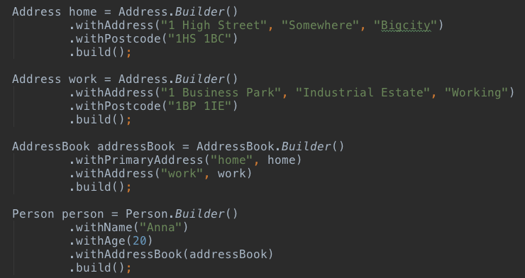
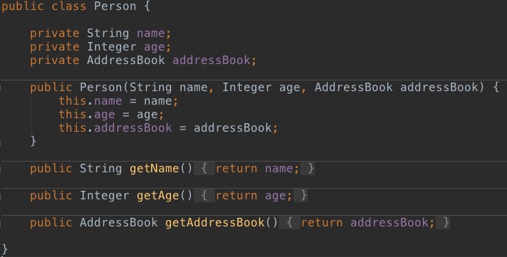
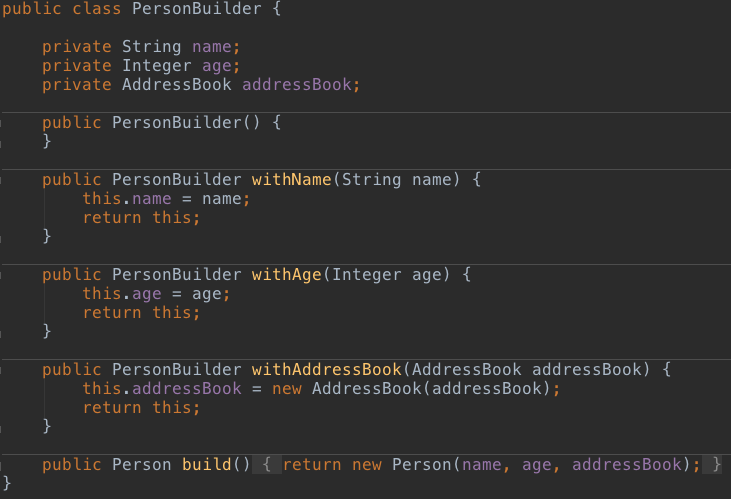
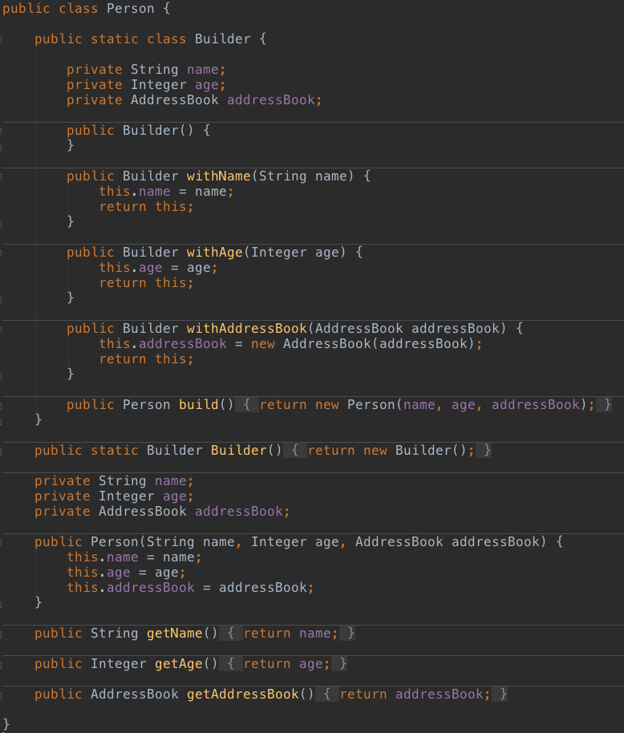
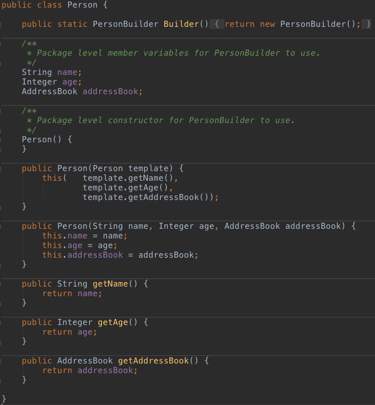
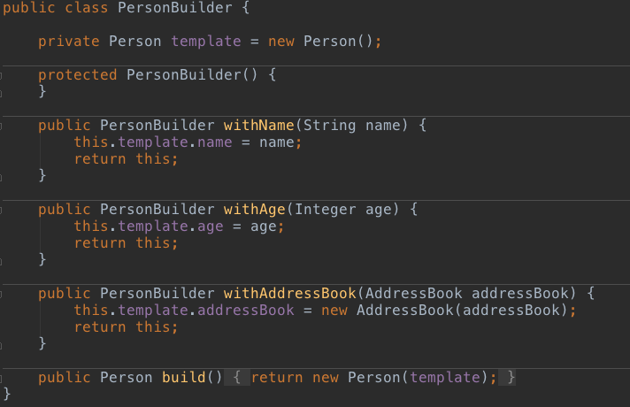

# Soulmate Builder Pattern

Repository to show different Builder pattern implementation styles.  There seem to be two common implementation styles, which I call the **External** and **Nested** styles, and I've added a third variation I call the **Soulmate Builder Pattern**.

_Example of Builder Pattern used to create Domain objects_

### External Builder Pattern Style

This style implements the `Builder` object completely independently from the domain object it is creating.  In the purest sense it keeps the domain object free from any Builder code contamination.

_Domain Object without any Builder code_

_External Builder example, needs to replicate the Domain objects members_

> Advantages:

* Domain object remains a pure PoJo, without any Builder code residue
* Domain object and Builder object maintain separation of concerns

> Disadvantages:

* Clients of the Builder need to know a Builder class exists
* Synchronization of Domain and Builder objects easy to forget
* Builder must repeat `private` members of the Domain object

### Nested Builder Pattern Style

This style implements the `Builder` object within the domain class itself, as a static inner class.  It keeps the builder code and domain object code together.

_Nested static Builder, keeps all Domain and Builder code together_

> Advantages:

* Synchronization of Domain and Builder objects easier, same file
* Easier for clients to find the Builder, available from Domain object
* Builder object can use Domain object instance as **template**

> Disadvantages:

* Domain object becomes a wash of Builder code (on top of Java's plumbing code)

### Soulmate Builder Pattern Style

This style attempts to combine the best of both External and Nested Builder Patterns.  It does this by compromising on the access level of constructors and member variables.

_Provide static Builder construction for clients, and package level access for members and constructor_

_Builder kept separate, private constructor, still gets to use instance of Domain object as template_

> Advantages:

* Easier for clients to find the Builder, available from the Domain object
* Builder object can use Domain object instance as `template`
* Domain object remains a pure PoJo with only Builder creation method
* Domain object and Builder object maintain separation of concerns

> Disadvantages:

* Constructors and member variable access needs to be coordinated

### Styles of Builder method naming

There is no standard naming convention when creating methods within a Builder, except perhaps to avoid the `set` prefix. When naming a Builder method that will return itself you might want to avoid the `set` prefix and instead try to use something more accumulative in nature.  Common prefixes are **`with`**, **`append`**, **`add`**.

Common prefixes for the final Domain object building method are build or create.  Usually without any further method naming.  However, by adding the Domain object to this method name (such as buildPerson) you can make it easier to know where you are in the stack of builder calls.  If the client code will have many Builders and lots of calls between Builder construction and the final build call this can ease maintenance.

### Conclusion

These are just a couple of Builder Pattern styles I've seen.  There doesn't appear to be strong consensus on a standard.  Any of the above feel like a compromise somewhere.  Just decide what your preferred compromise will be and stick to that style throughout your organizations code as best you can.

Companion for [Soulmate Builder Pattern Blog](http://www.roybailey.biz/blog/soulmate-builder-pattern/)
